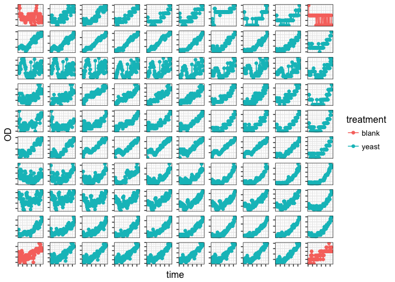
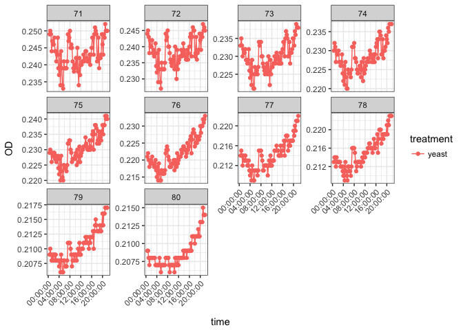

# yeast growth plots


* set up initial bioscreen expt on March 6 2017, at 16C

* goals for here: are they growing? How much variability do we see across wells?


Load packages

```r
library(tidyverse)
library(janitor)
```

Read in data

```r
yeast_raw <- read_csv("/Users/Joey/Documents/tomato/data-raw/bioscreen/16C_test_yeast_march6.csv")

yeast <- yeast_raw %>% 
	clean_names() %>% 
	filter(time > 905) %>%
	gather(key = "well", value = "OD", starts_with("well")) %>% 
	separate(well, into = c("well_number", "well_id")) %>% 
	select(-well_number) %>% 
	mutate(well_id = as.numeric(well_id) - 100) %>% 
	mutate(treatment = ifelse(well_id %in% c("1", "10", "91", "100"), "blank", "yeast"))
```

Plot!


```r
 yeast %>% 
	ggplot(aes(x = time, y = OD, color = treatment)) + geom_point() + 
	geom_line() +
	facet_wrap( ~ well_id, scales = "free_y") + theme_bw() + 
	theme(axis.text.x = element_blank(), axis.text.y = element_blank()) + 
	theme(strip.background = element_blank(),
				strip.text.x = element_blank()) + 
	theme(text = element_text(size = 12))
```

<!-- -->

<!-- -->

<!-- -->

<!-- -->

<!-- -->

<!-- -->

<!-- -->

<!-- -->

<!-- -->

<!-- -->

<!-- -->
